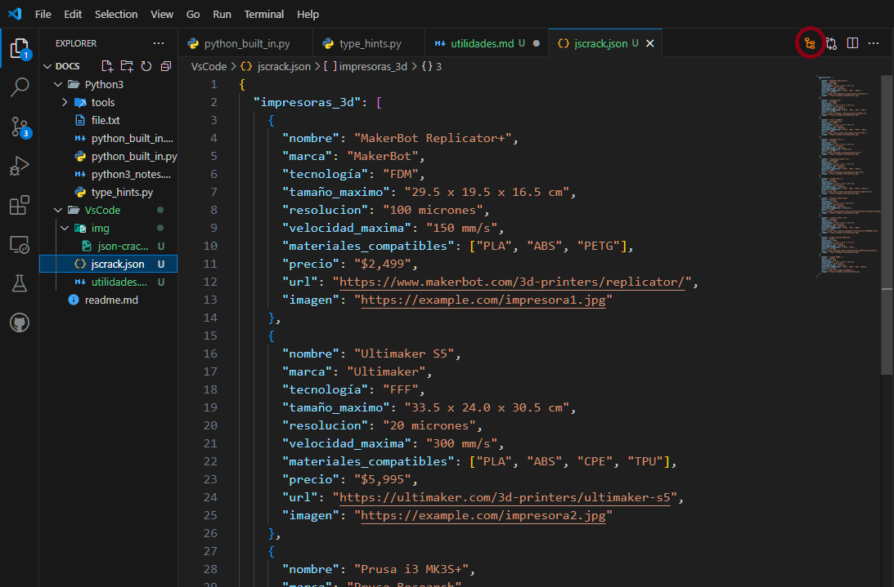
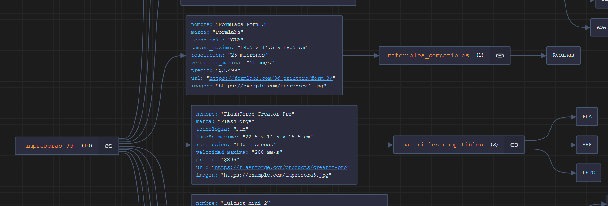

## 🔌 Plugins de Visual Studio Code

Visual Studio Code ofrece una amplia gama de plugins que mejoran la experiencia de desarrollo. Uno de ellos es:

### JSON Crack

JSON Crack es una extensión para Visual Studio Code que transforma archivos JSON en gráficos interactivos con solo un clic. Facilita la visualización de datos complejos, mejorando la experiencia de análisis y desarrollo.

**Cómo usarlo:**
1. Instala la extensión desde el marketplace de VS Code.
2. Abre un archivo JSON.
3. Haz clic en el icono de JSON Crack en la barra de menú.

¡Simplifica la visualización de datos JSON con JSON Crack en VS Code! 
