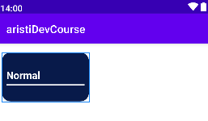

# Componentes de vista 
## View
Un ``View`` es la clase base para todos los componentes de la interfaz de usuario en Android. Todos los elementos de la interfaz gráfica, como botones, campos de texto, etc., son subclases de View.

### Atributos de View: 
* ``android:id`` Identificador único para la vista.
* ``android:layout_width`` Ancho de la vista.
* ``android:layout_height`` Altura de la vista.
* ``android:background`` Color o drawable de fondo de la vista.
* ``android:visibility`` Visibilidad de la vista (visible, invisible, gone).

## TextView 
``TextView`` es un componente que permite mostrar texto en la interfaz de usuario. Es uno de los elementos más básicos y comunes en el desarrollo de aplicaciones Android.
### Atributos de TextView: 
* ``android:text`` Texto que se muestra en el TextView.
* ``android:textColor`` Color del texto.
* ``android:textSize`` Tamaño del texto.
* ``android:gravity`` Alineación del texto dentro del TextView.
* ``android:fontFamily`` Familia de fuentes utilizada.

## EditText
EditText es una subclase de TextView que permite al usuario ingresar y editar texto. Es un componente de entrada de datos crucial en las aplicaciones Android.

### Atributos de EditText: 
android:hint: Texto de sugerencia que aparece cuando el campo está vacío.
android:inputType: Tipo de entrada de texto (texto, número, contraseña, etc.).
android:maxLength: Longitud máxima del texto.
android:singleLine: Indica si el campo es de una sola línea.
android:imeOptions: Opciones de IME (Input Method Editor) para el teclado.

## ConstraintLayout
``ConstraintLayout`` es un layout avanzado que permite crear interfaces complejas sin anidar múltiples layouts. Utiliza restricciones para posicionar y dimensionar los elementos.

### Atributos de TextView: 
* ``app:layout_constraintLeft_toLeftOf`` Restricción del borde izquierdo.
* ``app:layout_constraintRight_toRightOf`` Restricción del borde derecho.
* ``app:layout_constraintTop_toTopOf`` Restricción del borde superior.
* ``app:layout_constraintBottom_toBottomOf`` Restricción del borde inferior.
* ``app:layout_constraintHorizontal_bias`` Sesgo horizontal en la posición de la vista.


## AppCompatEdit
``AppCompatEditText`` es una versión compatible hacia atrás de EditText, proporcionando compatibilidad con versiones antiguas de Android.

### Atributos de AppCompatEdit: 
* ``android:text` Texto que se muestra en el campo.
* ``android:hint`` Texto de sugerencia.
* ``android:inputType`` Tipo de entrada de texto.
* ``android:textColorHint`` Color del texto de sugerencia.
* ``android:drawableStart`` Drawable que aparece al inicio del campo.

## AppCompatButton
``AppCompatButton`` es una versión compatible hacia atrás de Button, proporcionando compatibilidad con versiones antiguas de Android.

### Atributos de AppCompatButton: 
* ``android:text`` Texto que se muestra en el botón.
* ``android:background`` Color o drawable de fondo.
* ``android:textColor`` Color del texto.
* ``android:padding`` Padding interno del botón.
* ``android:layout_gravity`` Gravedad del botón dentro de su contenedor.

## CardView
``CardView`` es un componente que permite mostrar contenido dentro de una tarjeta con esquinas redondeadas y sombras, siguiendo las guías de Material Design.

### Atributos de CardView: 
* ``app:cardCornerRadius`` Radio de las esquinas de la tarjeta.
* ``app:cardElevation`` Elevación de la tarjeta (sombra).
* ``app:cardBackgroundColor`` Color de fondo de la tarjeta.

## ImageView
``ImageView`` es un componente utilizado para mostrar imágenes en la interfaz de usuario. Soporta diferentes tipos de recursos de imagen y opciones de escala.

### Atributos de ImageView: 
* ``android:src`` Recurso de la imagen a mostrar.
* ``android:contentDescription`` Descripción del contenido para accesibilidad.
* ``android:scaleType`` Tipo de escala para ajustar la imagen dentro del ImageView.
* ``android:tint`` Color para aplicar un tinte a la imagen.
* ``android:adjustViewBounds`` Ajusta los límites de la vista para mantener la relación de aspecto de la imagen.

## LinearLayout
``LinearLayout`` es un layout que organiza sus elementos hijos en una sola dirección, ya sea horizontal o vertical.

### Atributos de LinearLayout: 
* ``android:orientation`` Orientación del layout (horizontal o vertical).
* ``android:gravity`` Gravedad de todos los elementos hijos.
* ``android:weightSum`` Suma total de los pesos de los elementos hijos.
* ``android:baselineAligned`` Alineación de los elementos con la línea base.

## LinearLayoutCompat
``LinearLayoutCompat`` es una versión compatible hacia atrás de LinearLayout, proporcionando compatibilidad con versiones antiguas de Android.

### Atributos de LinearLayoutCompat: 
* ``android:orientation`` Orientación del layout (horizontal o vertical).
* ``android:gravity`` Gravedad de todos los elementos hijos.
* ``android:weightSum`` Suma total de los pesos de los elementos hijos.
* ``android:baselineAligned``: Alineación de los elementos con la línea base.

## RangeSlider
``RangeSlider`` es un componente que permite seleccionar un rango de valores mediante dos controles deslizantes.

### Atributos de RangeSlider: 
* ``android:valueFrom`` Valor mínimo del rango.
* ``android:valueTo`` Valor máximo del rango.
* ``android:values`` Valores actuales seleccionados.
* ``android:stepSize`` Tamaño del paso entre valores.
* ``android:thumbTint`` Color del control deslizante.

## FloatingActionButton
``FloatingActionButton`` es un botón flotante que generalmente se utiliza para representar una acción principal en una aplicación.

### Atributos de FloatingActionButton: 
* ``app:srcCompat`` Recurso de la imagen del botón.
* ``app:backgroundTint`` Color de fondo del botón.
* ``app:fabSize`` Tamaño del botón (normal o mini).
* ``app:rippleColor`` Color del efecto de onda al presionar.

## Button
``Button`` es un componente que permite al usuario realizar una acción mediante un toque.

### Atributos de Button: 
* ``android:text`` Texto que se muestra en el botón.
* ``android:background`` Color o drawable de fondo.
* ``android:textColor`` Color del texto.
* ``android:padding`` Padding interno del botón.
android:layout_gravity: Gravedad del botón dentro de su contenedor.

## RadioGroup
``RadioGroup`` es un contenedor para RadioButtons que permite seleccionar solo una opción a la vez.

### Atributos de RadioGroup:
* ``android:orientation`` Orientación del grupo (horizontal o vertical).
* ``android:checkedButton`` ID del botón seleccionado por defecto.
* ``android:gravity`` Gravedad de los elementos dentro del grupo.
* ``android:layout_gravity`` Gravedad del grupo dentro de su contenedor. 

## RadioButton
``RadioButton`` es un botón que permite seleccionar una opción dentro de un RadioGroup.

### Atributos de RadioButton: 
* ``android:text`` Texto que se muestra junto al botón.
* ``android:checked`` Indica si el botón está seleccionado.
* ``android:buttonTint`` Color del botón.
* ``android:gravity`` Alineación del texto y el botón.
* ``android:drawablePadding`` Espacio entre el drawable y el texto.

## FrameLayout
* ``FrameLayout`` es un layout que apila sus elementos hijos uno encima del otro.

### Atributos de FrameLayout: 
* ``android:foreground`` Drawable que se dibuja sobre los hijos.
* ``android:measureAllChildren`` Indica si se deben medir todos los hijos.
* ``android:foregroundGravity`` Gravedad del foreground.
* ``android:foregroundTint`` Color del tint del foreground.

## CheckBox
* ``CheckBox`` es un componente que permite al usuario seleccionar o deseleccionar una opción.

### Atributos de CheckBox: 
* ``android:text`` Texto que se muestra junto al botón.
* ``android:checked`` Indica si el botón está seleccionado.
* ``android:buttonTint`` Color del botón.
* ``android:gravity`` Alineación del texto y el botón.
* ``android:drawablePadding`` Espacio entre el drawable y el texto.

## Dialog
``Dialog`` es una ventana flotante que se utiliza para mostrar mensajes, solicitar información o permitir al usuario realizar acciones.

### Atributos de Dialog: 
* ``android:theme`` Tema del diálogo.
* ``android:cancelable`` Indica si el diálogo se puede cancelar.
* ``android:content`` Contenido del diálogo.
* ``android:layout_width`` Ancho del diálogo.
* ``android:layout_height`` Altura del diálogo.


# Navegación entre Activities y Envío de Datos en Android
1. **Asignación de ID en la Vista XML**
    Para asegurar que podemos referenciar correctamente los elementos de la vista desde nuestro código Kotlin, primero asignamos un ID a los componentes necesarios en nuestro archivo XML de layout. Por ejemplo, para un TextView, podemos hacerlo de la siguiente manera:

    ```xml
    <TextView
        android:id="@+id/tvResult"
        android:layout_width="wrap_content"
        android:layout_height="wrap_content"
        tools:text="Esto es un ejemplo"
        android:textSize="35sp"
        android:textColor="@color/teal_200"
        android:layout_gravity="center"
        />
    ```
2. **Creación e Inicialización de un Intent**

    En la Activity desde la que deseas navegar a la siguiente vista, debes instanciar un Intent. Esto te permitirá iniciar una nueva Activity y enviar datos a través de ella.
   
    ```kt 
    // Dentro de la actividad de origen
        import android.content.Intent
        import androidx.appcompat.app.AppCompatActivity
        import android.os.Bundle
        import android.widget.Button
        import android.widget.EditText

        class MainActivity : AppCompatActivity() {

            override fun onCreate(savedInstanceState: Bundle?) {
                super.onCreate(savedInstanceState)
                setContentView(R.layout.activity_main)

                // Referenciamos los elementos de la vista
                val btnClickMe = findViewById<Button>(R.id.btnClickMe)
                val etName = findViewById<EditText>(R.id.etName)

                // Configuramos el evento onClick para el botón
                btnClickMe.setOnClickListener {
                    // Obtenemos el texto del EditText
                    val name = etName.text.toString()
                    if (name.isNotEmpty()) {
                        // Creamos un Intent para iniciar la actividad de destino
                        val intent = Intent(this, ResultActivity::class.java).apply {
                            // Añadimos el dato (name) con un identificador "EXTRA_NAME"
                            putExtra("EXTRA_NAME", name)
                        }
                        // Iniciamos la actividad de destino
                        startActivity(intent)
                    }
                }
            }
        }
    ```

3. **Recuperación de Datos en del Activity de Destino**
   
   En la actividad a la que deseas acceder, puedes recuperar los datos enviados desde la actividad anterior utilizando Intent. 

   ```kt
    // Dentro de la actividad de destino
    import android.os.Bundle
    import android.widget.TextView
    import androidx.appcompat.app.AppCompatActivity

    class ResultActivity : AppCompatActivity() {

        override fun onCreate(savedInstanceState: Bundle?) {
            super.onCreate(savedInstanceState)
            setContentView(R.layout.activity_result)

            // Referenciamos el TextView
            val tvResult = findViewById<TextView>(R.id.tvResult)

            // Recuperamos el dato enviado desde la actividad anterior
            val name: String = intent.getStringExtra("EXTRA_NAME").orEmpty()

            // Mostramos el dato recuperado en el TextView
            tvResult.text = "Hola amigo $name"
        }
    }

   ```

4. **Volver a la Activity anterior**
   Para permitir al usuario regresar a la actividad anterior, podemos configurar un botón que utilice el onBackPressedDispatcher para manejar el evento de retroceso:
    ```kt
   // Dentro de la actividad de destino (ResultActivity)
    import android.widget.Button

    class ResultActivity : AppCompatActivity() {

        override fun onCreate(savedInstanceState: Bundle?) {
            super.onCreate(savedInstanceState)
            setContentView(R.layout.activity_result)

            // Referenciamos el botón
            val btnRecalculate = findViewById<Button>(R.id.btnRecalculate)

            // Configuramos el evento onClick para el botón de recalculación
            btnRecalculate.setOnClickListener {
                onBackPressedDispatcher.onBackPressed()
            }
        }
    }
    ```

# Ejemplo de uso con RecylerView
A continuación veremos un ejemplo de uso de un RecylerView para mostrar una lista de tareas organizadas en categorías.

1. **Agregar RecyclerView al Layout:**
En el archivo XML del layout donde quieres mostrar la lista, agrega un elemento RecyclerView.

    ```xml
        <androidx.recyclerview.widget.RecyclerView
            android:id="@+id/rvCategories"
            android:layout_width="match_parent"
            android:layout_height="wrap_content" />
    ```
2. **Crear el Layout del Ítem:** Define el diseño de un solo elemento de la lista en un archivo XML separado (por ejemplo, item_task_category.xml).
    ```xml
    <?xml version="1.0" encoding="utf-8"?>
    <androidx.cardview.widget.CardView xmlns:android="http://schemas.android.com/apk/res/android"
        android:layout_width="160dp"
        android:layout_height="90dp"
        android:id="@+id/viewContainer"
        xmlns:app="http://schemas.android.com/apk/res-auto"
        xmlns:tools="http://schemas.android.com/tools"
        app:cardBackgroundColor="@color/todo_background_card"
        app:cardCornerRadius="16dp"
        android:layout_marginHorizontal="8dp"
        android:layout_marginVertical="16dp"
        >

        <LinearLayout
            android:layout_width="match_parent"
            android:layout_height="match_parent"
            android:orientation="vertical"
            android:gravity="center_vertical"
            android:layout_margin="8dp"
            >
            <TextView
                android:id="@+id/tvCategoryName"
                android:layout_width="wrap_content"
                android:layout_height="wrap_content"
                tools:text="Normal"
                android:textStyle="bold"
                android:textColor="@color/white"
                android:textSize="19sp"
                />
            <View
                android:id="@+id/separator"
                android:layout_width="match_parent"
                android:layout_height="2dp"
                android:layout_marginTop="4dp"
                tools:background="@color/white"
                />
        </LinearLayout>

    </androidx.cardview.widget.CardView>
    ```
    *La siguiente imágen muestra el componente Category:*

    

3. **Definir una clase TaskCategory y Task para un RecyclerView**
   
    ```kt
    sealed class TaskCategory(var isSelected: Boolean = true) {
        object Personal : TaskCategory()
        object Business : TaskCategory()
        object Other : TaskCategory()
    }

    data class Task(val name: String, val category: TaskCategory, var isSelected: Boolean = false)
    ```

4. **Crear la Clase ViewHolder:**
Esta clase se encarga de almacenar las referencias a las vistas del ítem.

    ```kt
    class CategoriesViewHolder(view: View) : RecyclerView.ViewHolder(view) {

        private val tvCategoryName: TextView = view.findViewById(R.id.tvCategoryName)
        private val separator: View = view.findViewById(R.id.separator)
        private val viewContainer: CardView = view.findViewById(R.id.viewContainer)

        fun render(taskCategory: TaskCategory, onItemSelected: (Int) -> Unit) {
            val color = if(taskCategory.isSelected) {
                R.color.todo_background_card
            } else {
                R.color.todo_background_disabled
            }

            viewContainer.setCardBackgroundColor(ContextCompat.getColor(viewContainer.context, color))

            itemView.setOnClickListener { onItemSelected(layoutPosition) }

            when(taskCategory) {
                TaskCategory.Business -> {
                    tvCategoryName.text = "Negocios"
                    separator.setBackgroundColor(ContextCompat.getColor(separator.context, R.color.todo_business_category))
                }
                TaskCategory.Other -> {
                    tvCategoryName.text = "Otros"
                    separator.setBackgroundColor(ContextCompat.getColor(separator.context, R.color.todo_other_category))
                }
                TaskCategory.Personal -> {
                    tvCategoryName.text = "Personal"
                    separator.setBackgroundColor(ContextCompat.getColor(separator.context, R.color.todo_personal_category))
                }
            }
        }
    }
    ```
5. **Crear el Adapter:**
El Adapter es responsable de crear nuevos ViewHolders y vincular los datos a estos.
    ```kt 
    class CategoriesAdapter(private val categories: List<TaskCategory>, private val onItemSelected: (Int) -> Unit) :
        RecyclerView.Adapter<CategoriesViewHolder>() {

        override fun onCreateViewHolder(parent: ViewGroup, viewType: Int): CategoriesViewHolder {
            val view = LayoutInflater.from(parent.context).inflate(R.layout.item_task_category, parent, false)
            return CategoriesViewHolder(view)
        }

        override fun getItemCount(): Int = categories.size

        override fun onBindViewHolder(holder: CategoriesViewHolder, position: Int) {
            holder.render(categories[position], onItemSelected)
        }
    }
    ```

6. **Configurar el RecyclerView en la Actividad o Fragmento:**
En la actividad o fragmento donde se va a utilizar el RecyclerView, inicializa y configura el RecyclerView.

    ```kt
    class TodoActivity : AppCompatActivity() {

        private val categories = listOf(
            Business,
            Personal,
            Other
        )

        private val tasks = mutableListOf(
            Task("Tarea de Negocios", Business),
            Task("Tarea Personal", Personal),
            Task("Otra Tarea", Other)
        )

        private lateinit var rvCategories: RecyclerView
        private lateinit var categoriesAdapter: CategoriesAdapter

        override fun onCreate(savedInstanceState: Bundle?) {
            super.onCreate(savedInstanceState)
            setContentView(R.layout.activity_todo)

            initComponents()
            initUI()
        }

        private fun initComponents() {
            rvCategories = findViewById(R.id.rvCategories)
        }

        private fun initUI() {
            categoriesAdapter = CategoriesAdapter(categories) { position ->
                // Aquí implementa la lógica cuando se selecciona una categoría
                // Puedes actualizar las tareas mostradas o realizar otras acciones
            }

            rvCategories.layoutManager = LinearLayoutManager(this, LinearLayoutManager.HORIZONTAL, false)
            rvCategories.adapter = categoriesAdapter
        }
    }
    ```

## Ejemplo completo
[Ejemplo completo de un RecyclerView con Categorías y Tareas](./RecyclerView/)